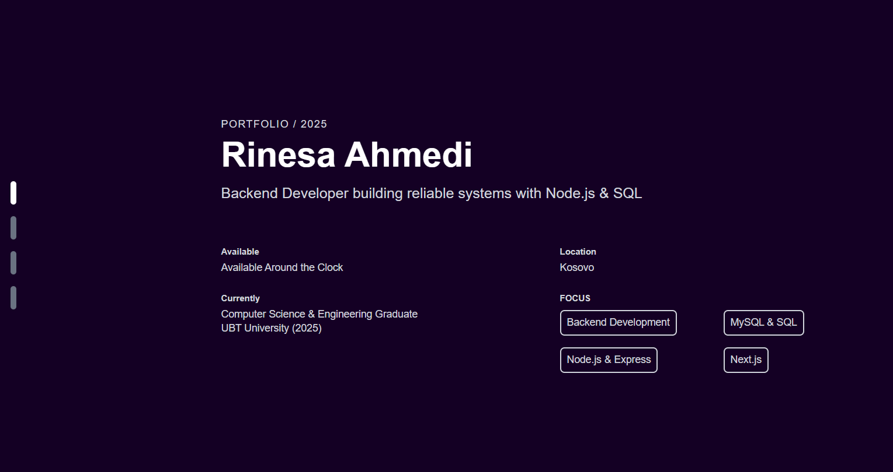

# 🌐 Portfolio Website

This is my personal portfolio website built with **Next.js** and **Tailwind CSS**.  
It showcases my projects, skills, and reflections about my journey in computer science and software development.

---

## 🚀 Features

- Responsive design with **Next.js** and **Tailwind CSS**
- **Dark/Light mode** support
- Projects section highlighting selected work (2022–2025)
- Reflections section with personal thoughts and experiences
- Clean and modern UI

---

## 🛠️ Tech Stack

- **Frontend:** Next.js, React, Tailwind CSS
- **Backend:** Node.js (for projects with APIs)
- **Database (in projects):** MySQL
- **Version Control:** Git, GitHub

---

## 📂 Sections

- **Home** – Introduction and overview
- **About / Reflections** – Personal thoughts and values
- **Projects** – Selected work with descriptions and technologies used
- **Contact** – Ways to reach me

---

## 🛠️ Built With

[](https://nextjs.org)
[](https://tailwindcss.com)

## 📸 Preview



---

## 📦 Installation & Setup

Clone the repository and install dependencies:

```bash
git clone https://github.com/rinesaahmedi/my-portofolio.git
cd my-portofolio
npm install
npm run dev
```
